# Newcomers's-EuroScope-Plugin / 新手的第一个EuroScope插件

## Visual Studio配置方法

### 前期准备

- X86架构的电脑
- 已安装并配置大部分环境的Visual Studio 2022
- 合格的网络环境
- 一个聪明的大脑

### 操作步骤

1. 前往`%appdata%/EuroScope/PlugIn/`复制`EuroScopePlugIn.h`、`EuroScopePlugInDll.lib`

2. 创建Visual Studio项目，点击“创建新项目(<u>N</u>)”


3. 搜索“MFC 动态链接库”，选择点击”下一步(<u>N</u>)“

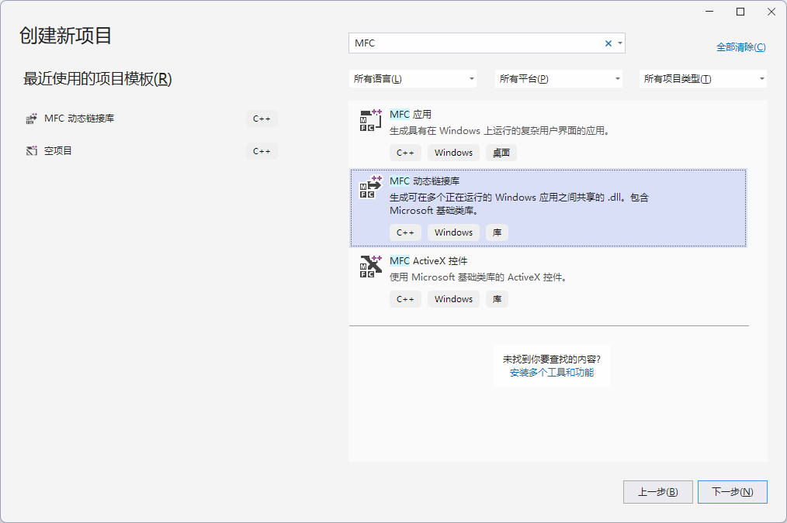

4. 点击“将解决方案和项目放在同一目录(<u>D</u>)”，在`项目名称(<u>J</u>)”填写你的插件名称，例如“MyEuroScopePlugIn”，，选择“位置(<u>L</u>)”。点击“创建(<u>C</u>)”

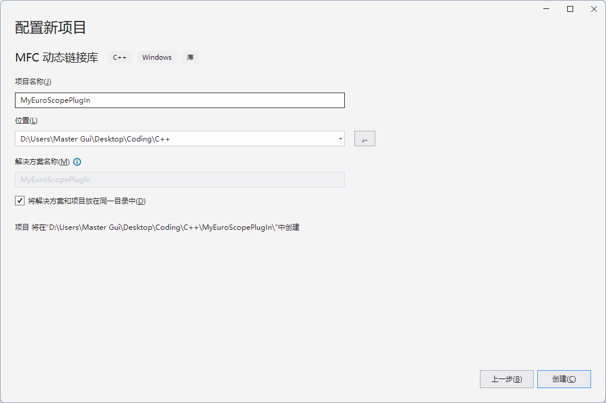

5. 点击“确认”即可

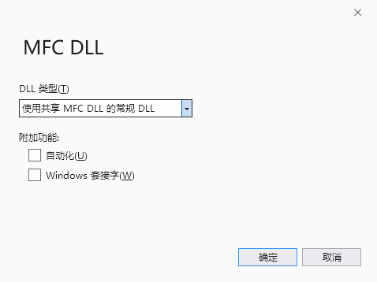

6. 在项目根目录创建`include`文件夹，将步骤1提到的`EuroScopePlugIn.h`、`EuroScopePlugInDll.lib`复制到里面

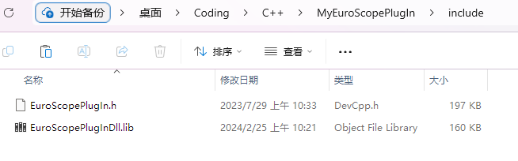

7. 在顶部菜单栏依次点击项目(<u>P</u>)、属性(<u>P</u>)

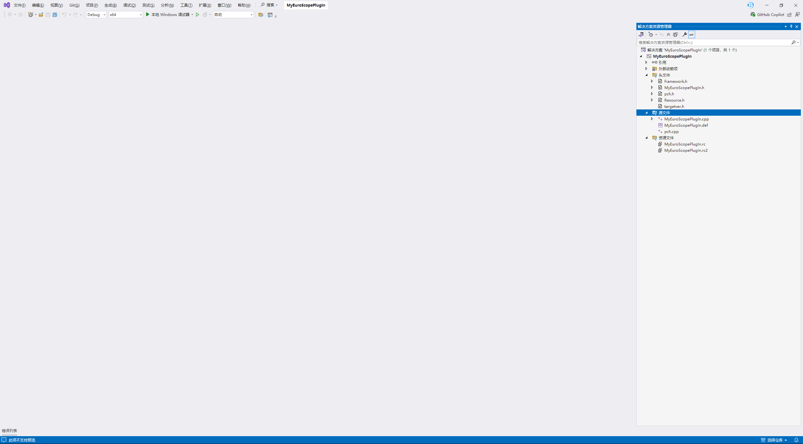

8. 依次点击“高级”、“字符集”、“试用多字节字符集”
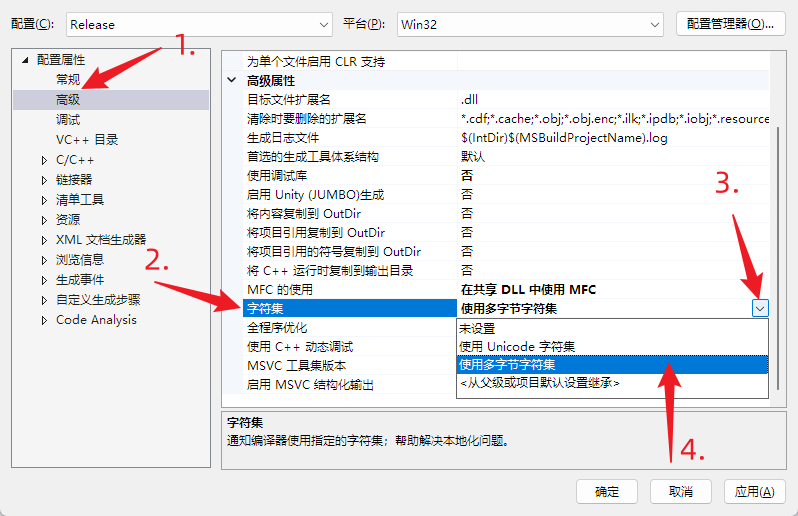

9. 依次点击“常规”、“附加包含目录”，输入`include`

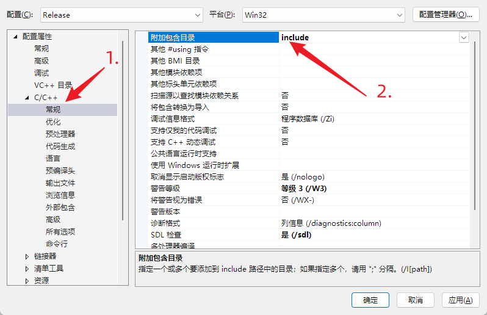

10. 依次点击“语言”、“将 WChar_t 视为内置类型”，选择“否 (/Zc:wchar_t-)”

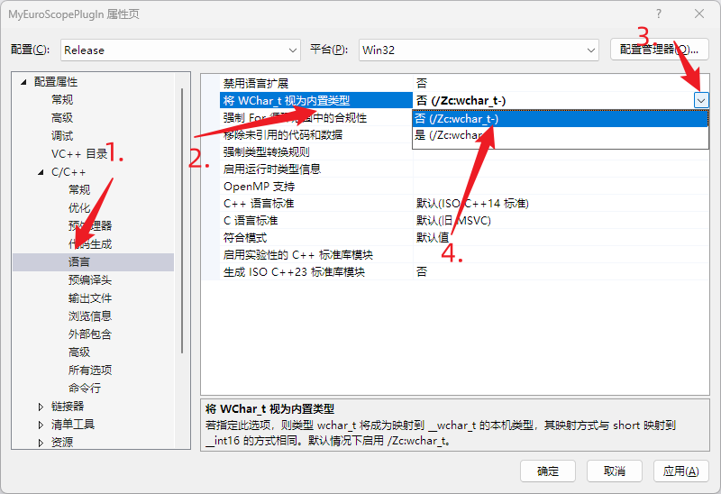

11. 依次点击“输入”、“附加依赖项”，输入`include/EuroScopePlugInDll.lib`

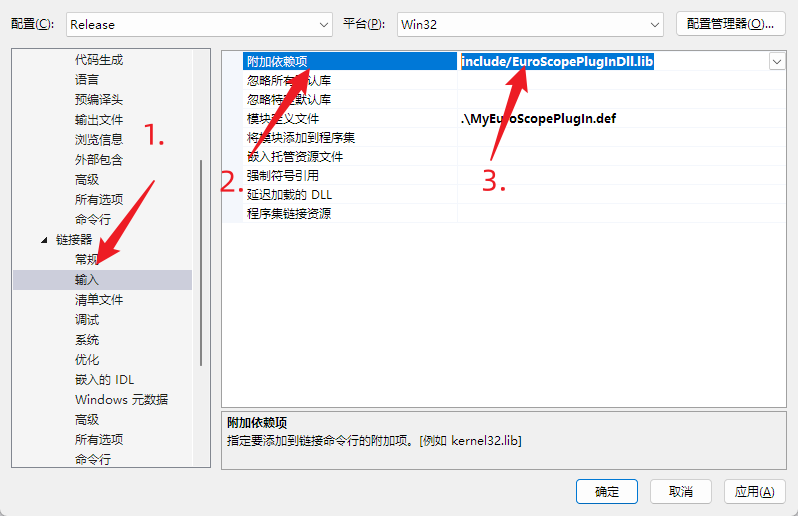

12. 点击“确定”

13. 对源文件右键“添加(<u>D</u>)”、“类(<u>C</u>)...”

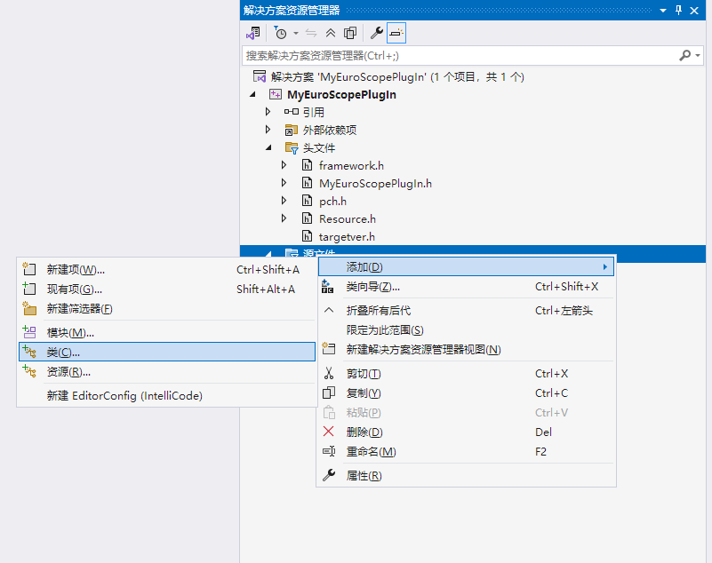

14. 填写类名(L)和基名(B)，

    > [!NOTE]
    >
    > 类名(L)：C+你想要的名称。例如：CESPlugIn（C-EuroScope-PlugIn）
    >
    > 基类(B)：必须填写`CPlugIn`，注意“C”、“P”、“I”均为大写

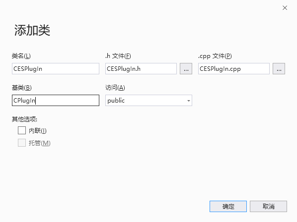

15. 点击确定

16. 在“解决方案配置”和“解决方案平台”选择“Release”和“x86”模式

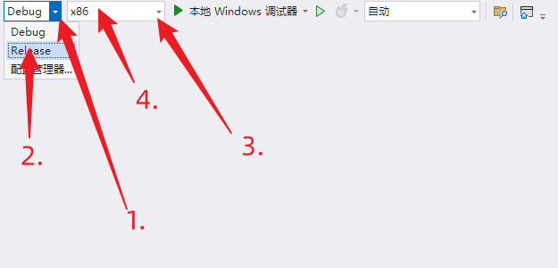

17. 在右侧的解决方案资源管理器打开`CESPlugIn.h`

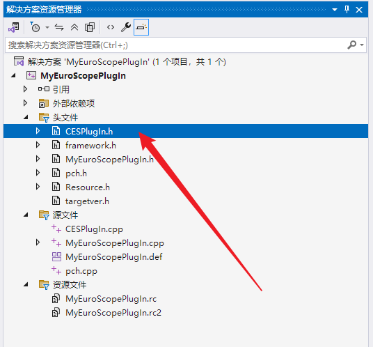

18. 增加include和命名空间

```c++
#pragma once
#include <EuroScopePlugIn.h>

using namespace EuroScopePlugIn;

class CESPlugIn :
    public CPlugIn
{
};
```

19. 替换CESPlugIn.cpp内的内容

```c++
#include "pch.h"
#include "CESPlugIn.h"
#include <string>

CESPlugIn* pMyPlugIn = nullptr;

void __declspec (dllexport)
EuroScopePlugInInit(EuroScopePlugIn::CPlugIn** ppPlugInInstance)
{
    *ppPlugInInstance = pMyPlugIn =
        new CESPlugIn();
}

void __declspec (dllexport)
EuroScopePlugInExit(void)
{
    delete pMyPlugIn;
}

CESPlugIn::CESPlugIn(void)
    :CPlugIn(EuroScopePlugIn::COMPATIBILITY_CODE,
        "Your Plugin name",
        "x.x.x",
        "Your name",
        "Your LICENSE")
{
    using namespace std;
    for (int i = 1; i <= 10000; i++) {
        DisplayUserMessage("NOTAM", "DearAuthor", string("Congratulations! 'Hello World!' No." + std::to_string(i)).c_str(), 1, 0, 0, 0, 0);
    }
}
```

20. 如遇错误，点击“显示可能的修补程序(Alt + Enter 或 Ctrl + .)”、“创建’CESPlugIn‘的声明(在 CESPlugIn.h中)(<u>D</u>)”

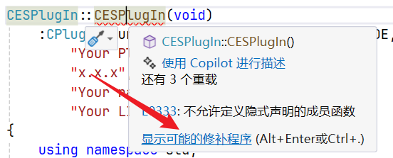

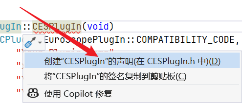

21. 此时发现还有错误，在`CESPlugIn.h`中`CESPlugIn(void);`上行加入`public:`

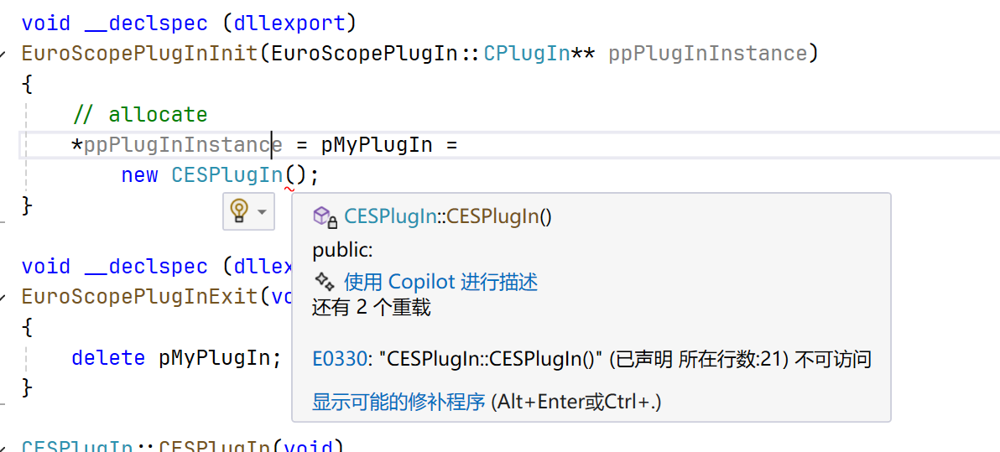

22. 点击“生成(<u>B</u>)、“生成解决方案(<u>B</u>)”或点击快捷键`F7`即可

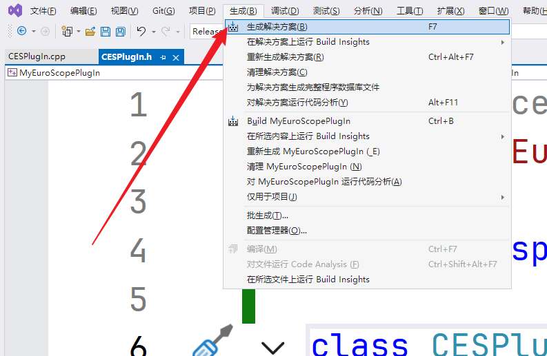

### 模板提供

懒得一步一步写代码了？在本文的`src`文件夹内提供现成的模板哦！

## 鸣谢

- [*Gergely Csernák*](mailto:info@euroscope.hu)
- [*Misaka-Nnnnq*](https://github.com/Misaka-Nnnnq)
- [*XiaoZhang*](https://github.com/XiaoZhang-store/)
- [*Master Gui*](https://github.com/supermastergui)
- 以及 [Vatsim People's Republic of China division](https://www.vatprc.net/zh-cn)

## 许可证

本项目采用[`MIT许可证`](https://github.com/supermastergui/EuroScope-PlugIn-Tutorial/blob/main/LICENSE)开源
